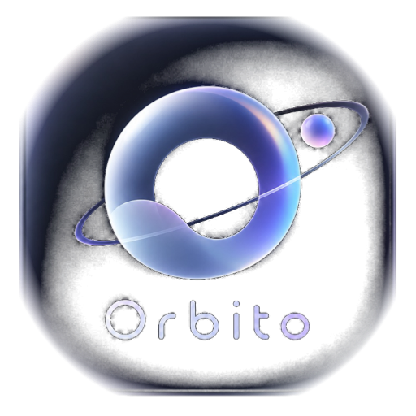

<div align="center">

  

  <h1 align="center" style="font-size: 2.6rem; font-weight: 800; margin-top: 14px; letter-spacing: -0.03em;">
    🪐 Orbito
  </h1>

  <p align="center" style="font-size: 1.15rem; color: #8a8a8e; max-width: 680px; line-height: 1.5;">
    <b>The Next-Gen Dynamic Notch, Real-Time Telemetry Engine & Command Center for macOS.</b><br>
    Transform your MacBook's hardware notch into an ultra-sleek, interactive productivity hub powered by native Mach kernel telemetry, 3D gyroscope unlock animations, and Apple-grade system modules.
  </p>

  <p align="center">
    <a href="https://github.com/Naivedhyajain20/Orbito/releases/latest">
      
    </a>
    <a href="https://github.com/Naivedhyajain20/Orbito/releases">
      
    </a>
    <a href="#-building-from-source">
      
    </a>
    <a href="#-features">
      
    </a>
  </p>

  <p align="center">
    <a href="#-key-features">Key Features</a> •
    <a href="#-architectural-overview">Architecture</a> •
    <a href="#-download--installation">Installation</a> •
    <a href="#-gestures--controls">Gestures</a> •
    <a href="#-building-from-source">Build from Source</a> •
    <a href="#-privacy--security">Privacy</a>
  </p>

</div>

---

## ⚡ Highlights at a Glance

<table>
  <tr>
    <td width="50%">
      <h3>🔓 3D Gyroscope Face ID Unlock</h3>
      <p>Brings iPhone Dynamic Island's futuristic unlock experience to your Mac. Features animated 3D rotating gyroscope rings that snap into a glowing emerald checkmark (✓) with authentic <b>Apple Pay sound effects</b> and tactile haptics on Touch ID / password unlock.</p>
    </td>
    <td width="50%">
      <h3>📊 Mach Kernel System Telemetry</h3>
      <p>Tap directly into macOS low-level Mach host statistics for real-time multi-core CPU rolling waveforms, GPU load, detailed physical memory pressure (Active, Wired, Compressed, Free), and live network I/O transfer meters.</p>
    </td>
  </tr>
  <tr>
    <td width="50%">
      <h3>💾 Macintosh HD Storage Visualizer</h3>
      <p>Native multi-segment APFS capacity analyzer color-coded across <i>Apps</i>, <i>Developer</i>, <i>iCloud Drive</i>, <i>macOS</i>, <i>System Data</i>, and <i>Available Space</i> with 1-click deep links to native macOS storage management.</p>
    </td>
    <td width="50%">
      <h3>📂 Notch File Shelf & AirDrop Staging</h3>
      <p>Turn your notch into a temporary drop zone. Drag files from Finder directly onto the notch to hold them across full-screen spaces, with instant AirDrop dispatch and drag-out capabilities into Slack, Mail, or Desktop.</p>
    </td>
  </tr>
  <tr>
    <td width="50%">
      <h3>📋 Smart Clipboard Manager</h3>
      <p>Automatic background history tracking with instant search, rich formatting previews, relative timestamps, and one-tap re-copying directly from the notch menu bar.</p>
    </td>
    <td width="50%">
      <h3>🎵 Dynamic Media HUD & Visualizer</h3>
      <p>Compact media island displaying live album art, track information, interactive scrubbing timeline, and responsive real-time audio waveforms across Apple Music, Spotify, YouTube Music, and web browsers.</p>
    </td>
  </tr>
</table>

---

## 🎯 Deep Dive: Key Features

### 1. 🔓 Dynamic Island Face ID Unlock Experience
- **3D Rotating Gyroscope Rings**: Smooth multi-axis rotation that illuminates upon macOS screen wake and Touch ID authentication.
- **Apple Pay Acoustic Feedback**: Integrated high-fidelity confirmation chime when unlock succeeds (`.mp3` audio engine powered by AVFoundation).
- **Customizable**: Toggle unlock animation, sound effects, and haptic feedback on or off anytime via **Settings > General > System features**.
- **Lock Screen Notch**: Optional SkyLight window integration allowing Orbito to remain visible and active directly on your macOS lock screen.

### 2. ⚡ Real-Time Hardware Telemetry
- **CPU Multi-Core Load**: Sub-millisecond Mach host statistics rendered via rolling Bezier waveforms.
- **GPU Core Utilization**: Live graphics engine telemetry without heavy polling overhead.
- **RAM Memory Pressure**: Instant diagnostic breakdown (Active, Wired, Compressed, Free memory).
- **Network Bandwidth Throughput**: Bidirectional download/upload speed counters.
- **Battery & Thermals**: Live wattage, battery cycle count, battery health state, and thermal status.

### 3. 📂 Notch File Shelf & AirDrop Dispatch
- **Frictionless Drag & Drop**: Hover over the notch while dragging any file to reveal the staging shelf.
- **Multi-File Batching**: Stage multiple documents, images, and archives simultaneously.
- **Instant AirDrop**: One-click sharing icon to immediately broadcast staged files to nearby Apple devices.

### 4. 📋 Intelligent Clipboard Timeline
- **Rich Snippet History**: Automatically captures plain text, formatted code, and links.
- **Instant Fuzzy Filtering**: Search through your clippings with instant keyboard navigation.
- **One-Tap Re-Copy**: Re-insert previous items into your active pasteboard in milliseconds.

### 5. ⏱️ Focus & Productivity Module
- **Pomodoro Timer**: Customizable focus/break intervals with progress rings and audio notifications.
- **Calendar & Agenda Integration**: Direct EventKit integration displaying upcoming meetings and schedules.
- **Quick Notes & Scratchpad**: Transient scratchpad for rapid thought capture without opening heavy note apps.

### 6. 🎛️ Minimalist Floating HUDs
- Elegant replacement HUDs for **Volume**, **Display Brightness**, and **Keyboard Backlight** with customizable percentages and glassmorphism backgrounds.

---

## 🏗️ Architectural Overview

```
                               ┌─────────────────────────────────────────┐
                               │              ORBITO NOTCH               │
                               │        [SwiftUI / Combine Engine]       │
    ┌──────────────────────────┴─────────────────────────────────────────┴──────────────────────────┐
    │                                                                                               │
    ▼                                  ▼                                  ▼                         ▼
┌────────────────────────┐ ┌────────────────────────┐ ┌────────────────────────┐ ┌────────────────────────┐
│  🔓 Face ID & Unlock   │ │  📊 Kernel Telemetry   │ │   📂 File Shelf & Tray │ │   🎵 Dynamic Media     │
├────────────────────────┤ ├────────────────────────┤ ├────────────────────────┤ ├────────────────────────┤
│ • 3D Gyroscope Engine  │ │ • Mach Host Statistics │ │ • Drag & Drop Target   │ │ • MediaRemoteAdapter   │
│ • AVFoundation Sound   │ │ • IOKit Power & Battery│ │ • AirDrop NSSharing    │ │ • NowPlaying APIs      │
│ • SkyLight Windowing   │ │ • APFS Volume Breakdown│ │ • Sandbox File Security│ │ • Live Audio Visualizer│
└────────────────────────┘ └────────────────────────┘ └────────────────────────┘ └────────────────────────┘
```

- **100% Native Swift 5.9+ & SwiftUI**: Zero Electron, zero web wrappers, zero bloated runtimes.
- **Sub-1% Idle CPU Overhead**: Event-driven timers and Mach kernel callbacks ensure battery longevity.
- **Display Adaptive**: Automatically resizes and re-centers across MacBook Pro liquid retina notch displays as well as notchless external 4K/5K displays.

---

## 📥 Download & Installation

### Option 1: Direct Download (Recommended)

1. Download the latest **[`Orbito.dmg`](https://github.com/Naivedhyajain20/Orbito/releases/latest)** from GitHub Releases.
2. Open `Orbito.dmg` and drag **Orbito.app** into your `/Applications` folder.
3. **First Launch (macOS Gatekeeper Notice)**:
   Because Orbito is independently built, macOS may show a security prompt on first launch. You can bypass this with one quick command in Terminal:
   ```bash
   xattr -cr /Applications/Orbito.app
   ```
4. Launch **Orbito** from Spotlight or `/Applications`!

---

## 🚀 Building from Source

### Prerequisites
- macOS 14.0 (Sonoma) or macOS 15.0+ (Sequoia)
- Xcode 15.0 or later
- Swift 5.9+

### Build Steps

```bash
# 1. Clone the repository
git clone https://github.com/Naivedhyajain20/Orbito.git
cd Orbito

# 2. Build in Release configuration
xcodebuild -scheme boringNotch -configuration Release -derivedDataPath build_release build

# 3. Launch the built app
open build_release/Build/Products/Release/boringNotch.app
```

---

## ⌨️ Gestures & Controls

| Shortcut / Gesture | Action |
| :--- | :--- |
| **Cursor Hover on Notch** | Expand the interactive notch HUD |
| **Two-Finger Swipe Down** | Open notch manually (when hover delay is off) |
| **Two-Finger Swipe Up** | Close/collapse notch back to hardware bar |
| **File Drag Over Notch** | Activate Notch Shelf drop zone |
| **`⌘ ,` (Command + Comma)** | Open Orbito Preferences & Customization Window |

---

## ⚙️ Customization & Settings

Orbito offers deep personalization options:
- **Lock Screen & Unlock**: Toggle notch visibility on lock screen, Face ID unlock animation, and Apple Pay sound effects.
- **Notch Sizing**: Match real physical notch size, match menu bar height, or set custom pixel dimensions.
- **Visual Styles**: Dynamic Liquid Glass, Frosted Dark Glass, ambient lighting effects, and custom accent colors.
- **Multi-Display**: Choose preferred display or show Orbito across all connected screens.

---

## 🔒 Privacy & Security

- **100% Local Execution**: All computations, telemetry, and clipboard history remain strictly on your Mac.
- **Zero Telemetry / Zero Analytics**: Orbito does not connect to any tracking servers or telemetry endpoints.
- **Open Source Transparency**: Audit the full codebase anytime on GitHub.

---

## 🤝 Contributing

Contributions, feature suggestions, and bug reports are warmly welcome!
1. Fork the Project (`https://github.com/Naivedhyajain20/Orbito/fork`)
2. Create your Feature Branch (`git checkout -b feature/AmazingFeature`)
3. Commit your Changes (`git commit -m 'feat: add some AmazingFeature'`)
4. Push to the Branch (`git push origin feature/AmazingFeature`)
5. Open a Pull Request

---

<div align="center">
  <p>Crafted with ❤️ for macOS power users.</p>
  <p>
    <a href="https://github.com/Naivedhyajain20/Orbito">GitHub Repository</a> •
    <a href="https://github.com/Naivedhyajain20/Orbito/releases">Releases</a> •
    <a href="https://github.com/Naivedhyajain20/Orbito/issues">Report an Issue</a>
  </p>
</div>
